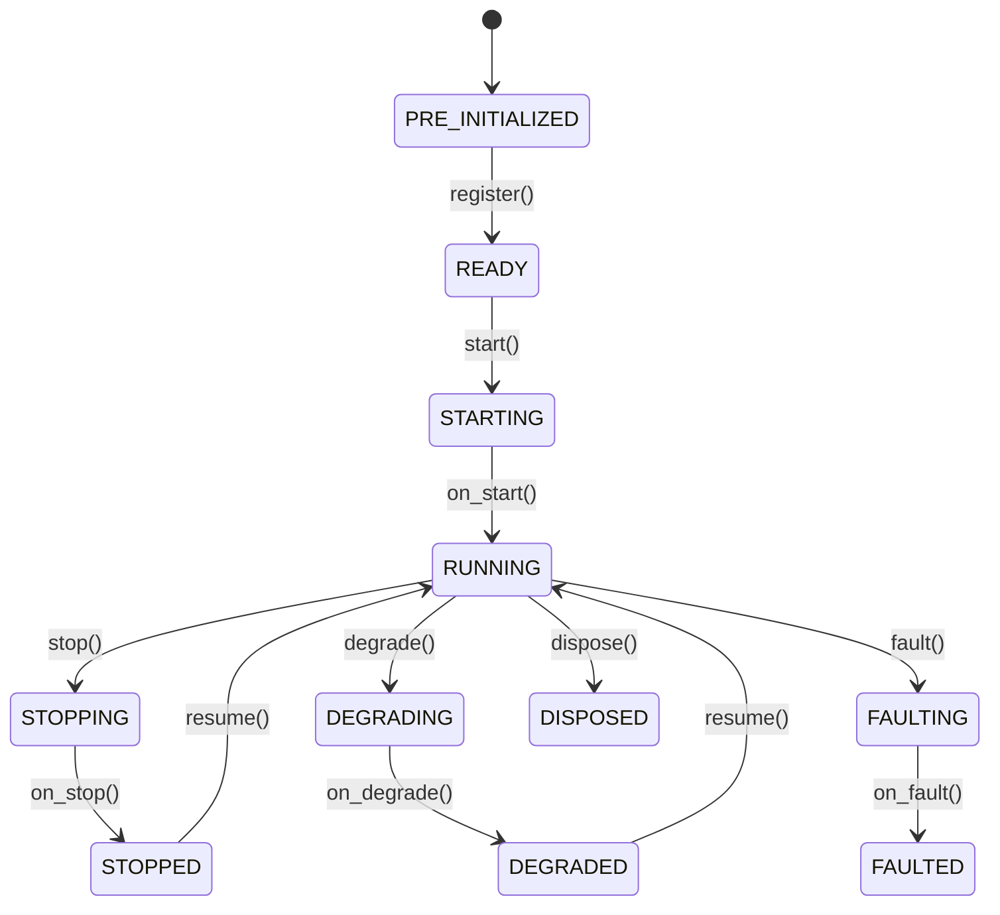

# Actors

> **NT v2 compatibility note:** Python examples in this file are retained pre-V2 migration/reference-only content (whole file); current V2 APIs are the flat `nautilus_trader.model` / `nautilus_trader.testkit` surfaces documented in the pinned upstream docs.

An `Actor` receives data, handles events, and manages state. The `Strategy` class extends Actor
with order management capabilities.

**Key capabilities**:

- Data subscription and requests (market data, custom data).
- Event handling and publishing.
- Timers and alerts.
- Cache and portfolio access.
- Logging.

## Basic example

Actors support configuration through a pattern similar to strategies.

```python
from nautilus_trader.config import ActorConfig
from nautilus_trader.model import InstrumentId
from nautilus_trader.model import Bar, BarType
from nautilus_trader.common.actor import Actor


class MyActorConfig(ActorConfig):
    instrument_id: InstrumentId   # example value: "ETHUSDT-PERP.BINANCE"
    bar_type: BarType             # example value: "ETHUSDT-PERP.BINANCE-15-MINUTE[LAST]-INTERNAL"
    lookback_period: int = 10


class MyActor(Actor):
    def __init__(self, config: MyActorConfig) -> None:
        super().__init__(config)

        # Custom state variables
        self.count_of_processed_bars: int = 0

    def on_start(self) -> None:
        # Subscribe to bars matching the configured bar type
        self.subscribe_bars(self.config.bar_type)

    def on_bar(self, bar: Bar) -> None:
        self.count_of_processed_bars += 1
```

## Lifecycle

Actors follow a defined state machine through their lifecycle:



Override these methods to hook into lifecycle events:

| Method          | When called                                                         |
|-----------------|---------------------------------------------------------------------|
| `on_start()`    | Actor is starting (subscribe to data here).                         |
| `on_stop()`     | Actor is stopping (cancel timers, cleanup resources).               |
| `on_resume()`   | Actor is resuming from a stopped state.                             |
| `on_reset()`    | Reset indicators and internal state (called between backtest runs). |
| `on_degrade()`  | Actor is entering a degraded state (partial functionality).         |
| `on_fault()`    | Actor has encountered a critical fault.                             |
| `on_dispose()`  | Actor is being disposed (final cleanup).                            |

## Timers and alerts

Actors have access to a clock for scheduling:

```python
def on_start(self) -> None:
    # Set a recurring timer (fires every 5 seconds)
    self.clock.set_timer("my_timer", timedelta(seconds=5))

    # Set a one-time alert
    self.clock.set_alert("my_alert", self.clock.utc_now() + timedelta(minutes=1))

def on_stop(self) -> None:
    # Cancel timers to prevent resource leaks across stop/resume cycles
    self.clock.cancel_timer("my_timer")

def on_timer(self, event: TimeEvent) -> None:
    if event.name == "my_timer":
        self.log.info("Timer fired!")

def on_alert(self, event: TimeEvent) -> None:
    if event.name == "my_alert":
        self.log.info("Alert triggered!")
```

## System access

Actors have access to core system components:

| Property          | Description                                              |
|-------------------|----------------------------------------------------------|
| `self.cache`      | Shared state for instruments, orders, positions, etc.    |
| `self.portfolio`  | Portfolio state and calculations.                        |
| `self.clock`      | Current time and timer/alert scheduling.                 |
| `self.log`        | Structured logging.                                      |
| `self.msgbus`     | Publish/subscribe to custom messages.                    |

For custom messaging between components, see the [Message Bus](message_bus.md) guide.

## Data handling and callbacks

When working with data in Nautilus, it's important to understand the relationship between data
*requests/subscriptions* and their corresponding callback handlers. The system uses different handlers
depending on whether the data is historical or real-time.

### Historical vs real-time data

The system distinguishes between two types of data flow:

1. **Historical data** (from *requests*):
   - Obtained through methods like `request_bars()`, `request_quotes()`, etc.
   - Processed through type-specific batch handlers like `on_historical_bars()` and
     `on_historical_quotes()` (custom data uses `on_historical_data()`).
   - Used for initial data loading and historical analysis.

2. **Real-time data** (from *subscriptions*):
   - Obtained through methods like `subscribe_bars()`, `subscribe_quotes()`, etc.
   - Processed through specific handlers like `on_bar()`, `on_quote()`, etc.
   - Used for live data processing.

### Callback handlers

Here's how different data operations map to their handlers:

| Operation                       | Category     | Handler                         | Purpose                                    |
| ------------------------------- | ------------ | ------------------------------- | ------------------------------------------ |
| `subscribe_data()`              | Subscription | `on_data()`                     | Custom data updates.                       |
| `subscribe_signal()`            | Subscription | `on_signal()`                   | Signal updates.                            |
| `subscribe_instrument()`        | Subscription | `on_instrument()`               | Instrument definition updates.             |
| `subscribe_instruments()`       | Subscription | `on_instrument()`               | Instrument definition updates for a venue. |
| `subscribe_book_deltas()`       | Subscription | `on_book_deltas()`              | Order book deltas.                         |
| `subscribe_book_depth10()`      | Subscription | `on_book_depth()`               | Order book depth snapshots.                |
| `subscribe_book_at_interval()`  | Subscription | `on_book()`                     | Order book snapshots at intervals.         |
| `subscribe_quotes()`            | Subscription | `on_quote()`                    | Quote updates.                             |
| `subscribe_trades()`            | Subscription | `on_trade()`                    | Trade updates.                             |
| `subscribe_mark_prices()`       | Subscription | `on_mark_price()`               | Mark price updates.                        |
| `subscribe_index_prices()`      | Subscription | `on_index_price()`              | Index price updates.                       |
| `subscribe_bars()`              | Subscription | `on_bar()`                      | Bar updates.                               |
| `subscribe_funding_rates()`     | Subscription | `on_funding_rate()`             | Funding rate updates.                      |
| `subscribe_instrument_status()` | Subscription | `on_instrument_status()`        | Instrument status updates.                 |
| `subscribe_instrument_close()`  | Subscription | `on_instrument_close()`         | Instrument close updates.                  |
| `subscribe_option_greeks()`     | Subscription | `on_option_greeks()`            | Option Greek updates.                      |
| `subscribe_option_chain()`      | Subscription | `on_option_chain()`             | Option chain slice snapshots.              |
| `request_data()`                | Request      | `on_historical_data()`          | Historical custom data.                    |
| `request_book_deltas()`         | Request      | `on_historical_book_deltas()`   | Historical order book deltas.              |
| `request_book_depth()`          | Request      | `on_historical_book_depth()`    | Historical order book depth.               |
| `request_book_snapshot()`       | Request      | `on_book()`                     | Order book snapshot.                       |
| `request_instrument()`          | Request      | `on_instrument()`               | Instrument definition.                     |
| `request_instruments()`         | Request      | `on_instrument()`               | Instrument definitions.                    |
| `request_quotes()`              | Request      | `on_historical_quotes()`        | Historical quotes.                         |
| `request_trades()`              | Request      | `on_historical_trades()`        | Historical trades.                         |
| `request_bars()`                | Request      | `on_historical_bars()`          | Historical bars.                           |
| `request_funding_rates()`       | Request      | `on_historical_funding_rates()` | Historical funding rates.                  |

### Example

Here's an example demonstrating both historical and real-time data handling:

```python
from nautilus_trader.common.actor import Actor
from nautilus_trader.config import ActorConfig
from nautilus_trader.core.data import Data
from nautilus_trader.model import Bar, BarType
from nautilus_trader.model import ClientId, InstrumentId


class MyActorConfig(ActorConfig):
    instrument_id: InstrumentId  # example value: "AAPL.XNAS"
    bar_type: BarType            # example value: "AAPL.XNAS-1-MINUTE-LAST-EXTERNAL"


class MyActor(Actor):
    def __init__(self, config: MyActorConfig) -> None:
        super().__init__(config)
        self.bar_type = config.bar_type

    def on_start(self) -> None:
        # Request historical data - will be processed by on_historical_data() handler
        self.request_bars(
            bar_type=self.bar_type,
            # Many optional parameters
            start=None,                # pd.Timestamp | None
            end=None,                  # pd.Timestamp | None
            callback=None,             # Callable[[UUID4], None] | None
            update_catalog_mode=None,  # UpdateCatalogMode | None
            params=None,               # dict[str, Any] | None
        )

        # Subscribe to real-time data - will be processed by on_bar() handler
        self.subscribe_bars(
            bar_type=self.bar_type,
            # Many optional parameters
            client_id=None,  # ClientId, optional
            params=None,     # dict[str, Any], optional
        )

    def on_historical_data(self, data: Data) -> None:
        # Handle historical data (from requests)
        if isinstance(data, Bar):
            self.log.info(f"Received historical bar: {data}")

    def on_bar(self, bar: Bar) -> None:
        # Handle real-time bar updates (from subscriptions)
        self.log.info(f"Received real-time bar: {bar}")
```

This separation between historical and real-time data handlers allows for different processing logic
based on the data context. For example, you might want to:

- Use historical data to initialize indicators or establish baseline metrics.
- Process real-time data differently for live trading decisions.
- Apply different validation or logging for historical vs real-time data.

:::tip
When debugging data flow issues, check that you're looking at the correct handler for your data source.
If you're not seeing data in `on_bar()` but see log messages about receiving bars, check `on_historical_data()`
as the data might be coming from a request rather than a subscription.
:::

## Order event handlers

Order lifecycle events flow through the message bus rather than data-engine subscriptions. Handle `OrderFilled` and
`OrderCanceled` messages in `on_order_filled()` and `on_order_canceled()` while the actor is running. Use message-bus
topics when a component must observe order events beyond its normal handler routing.

## Rust actors

Rust actors implement the `DataActor` trait, store runtime identity and state in
`DataActorCore`, and use the subscription/request facade methods on `self` (the
same v2 names as the table above). The pinned upstream how-to guide walks through
a complete Rust actor end to end: `docs/how_to/write_rust_actor.md` in the pinned
checkout.

## Related guides

- [Strategies](strategies.md) - Strategies extend actors with order management capabilities.
- [Data](data.md) - Data types and subscriptions available to actors.
- [Message Bus](message_bus.md) - The messaging system actors use for communication.
