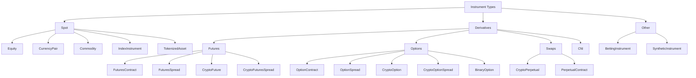

# Instruments

An instrument represents the specification for a tradable asset, contract, or local
synthetic market. Market data, orders, positions, accounting, portfolio calculations,
and adapter symbology all refer back to an `InstrumentId` and its instrument definition.

NautilusTrader exposes the same instrument model to Rust and Python users. Rust
examples use `nautilus_model`; Python examples use `nautilus_trader.model`.

## Instrument types

| Instrument type                                   | `InstrumentClass` | Description                                          | Typical adapters                |
| ------------------------------------------------- | ----------------- | ---------------------------------------------------- | ------------------------------- |
| [`Equity`](https://github.com/nautechsystems/nautilus_trader/blob/81d0449da0e353d702d88019dc73d231d67923cd/docs/concepts/instruments/equity.md)                             | `SPOT`            | Listed share or ETF traded on a cash market.         | Databento, Interactive Brokers. |
| [`CurrencyPair`](https://github.com/nautechsystems/nautilus_trader/blob/81d0449da0e353d702d88019dc73d231d67923cd/docs/concepts/instruments/currency_pair.md)                | `SPOT`            | Fiat FX or crypto spot pair in base/quote form.      | Binance, Kraken, OKX, Tardis.   |
| [`Commodity`](https://github.com/nautechsystems/nautilus_trader/blob/81d0449da0e353d702d88019dc73d231d67923cd/docs/concepts/instruments/commodity.md)                       | `SPOT`            | Spot commodity such as gold or oil.                  | Interactive Brokers.            |
| [`Cfd`](https://github.com/nautechsystems/nautilus_trader/blob/81d0449da0e353d702d88019dc73d231d67923cd/docs/concepts/instruments/cfd.md)                                   | `CFD`             | Contract for difference tracking an underlying.      | Interactive Brokers.            |
| [`IndexInstrument`](https://github.com/nautechsystems/nautilus_trader/blob/81d0449da0e353d702d88019dc73d231d67923cd/docs/concepts/instruments/index_instrument.md)          | `SPOT`            | Reference index, not directly tradable.              | Interactive Brokers.            |
| [`TokenizedAsset`](https://github.com/nautechsystems/nautilus_trader/blob/81d0449da0e353d702d88019dc73d231d67923cd/docs/concepts/instruments/tokenized_asset.md)            | `SPOT`            | Tokenized asset on a crypto venue.                   | Kraken.                         |
| [`FuturesContract`](https://github.com/nautechsystems/nautilus_trader/blob/81d0449da0e353d702d88019dc73d231d67923cd/docs/concepts/instruments/futures_contract.md)          | `FUTURE`          | Dated futures contract.                              | Databento, Interactive Brokers. |
| [`FuturesSpread`](https://github.com/nautechsystems/nautilus_trader/blob/81d0449da0e353d702d88019dc73d231d67923cd/docs/concepts/instruments/futures_spread.md)              | `FUTURES_SPREAD`  | Exchange defined futures strategy with several legs. | Databento, Interactive Brokers. |
| [`CryptoFuture`](https://github.com/nautechsystems/nautilus_trader/blob/81d0449da0e353d702d88019dc73d231d67923cd/docs/concepts/instruments/crypto_future.md)                | `FUTURE`          | Dated crypto futures contract.                       | Bybit, Deribit, OKX.            |
| [`CryptoFuturesSpread`](https://github.com/nautechsystems/nautilus_trader/blob/81d0449da0e353d702d88019dc73d231d67923cd/docs/concepts/instruments/crypto_futures_spread.md) | `FUTURES_SPREAD`  | Exchange defined crypto futures spread.              | Deribit, OKX.                   |
| [`CryptoPerpetual`](https://github.com/nautechsystems/nautilus_trader/blob/81d0449da0e353d702d88019dc73d231d67923cd/docs/concepts/instruments/crypto_perpetual.md)          | `SWAP`            | Crypto perpetual futures contract.                   | Binance, Bybit, dYdX.           |
| [`PerpetualContract`](https://github.com/nautechsystems/nautilus_trader/blob/81d0449da0e353d702d88019dc73d231d67923cd/docs/concepts/instruments/perpetual_contract.md)      | `SWAP`            | Perpetual futures contract across asset classes.     | Architect AX, Binance.          |
| [`OptionContract`](https://github.com/nautechsystems/nautilus_trader/blob/81d0449da0e353d702d88019dc73d231d67923cd/docs/concepts/instruments/option_contract.md)            | `OPTION`          | Exchange traded put or call option.                  | Databento, Interactive Brokers. |
| [`OptionSpread`](https://github.com/nautechsystems/nautilus_trader/blob/81d0449da0e353d702d88019dc73d231d67923cd/docs/concepts/instruments/option_spread.md)                | `OPTION_SPREAD`   | Exchange defined options strategy with several legs. | Databento, Interactive Brokers. |
| [`CryptoOption`](https://github.com/nautechsystems/nautilus_trader/blob/81d0449da0e353d702d88019dc73d231d67923cd/docs/concepts/instruments/crypto_option.md)                | `OPTION`          | Option on a crypto underlying.                       | Bybit, Deribit, OKX, Tardis.    |
| [`CryptoOptionSpread`](https://github.com/nautechsystems/nautilus_trader/blob/81d0449da0e353d702d88019dc73d231d67923cd/docs/concepts/instruments/crypto_option_spread.md)   | `OPTION_SPREAD`   | Exchange defined crypto option spread.               | Deribit, OKX.                   |
| [`BinaryOption`](https://github.com/nautechsystems/nautilus_trader/blob/81d0449da0e353d702d88019dc73d231d67923cd/docs/concepts/instruments/binary_option.md)                | `BINARY_OPTION`   | Binary instrument that settles to 0 or 1.            | Hyperliquid, OKX, Polymarket.   |
| [`BettingInstrument`](https://github.com/nautechsystems/nautilus_trader/blob/81d0449da0e353d702d88019dc73d231d67923cd/docs/concepts/instruments/betting_instrument.md)      | `SPORTS_BETTING`  | Sports or gaming market selection.                   | Betfair.                        |
| [`SyntheticInstrument`](https://github.com/nautechsystems/nautilus_trader/blob/81d0449da0e353d702d88019dc73d231d67923cd/docs/concepts/instruments/synthetic_instrument.md)  | n/a               | Formula derived local instrument.                    | Local only.                     |

## Taxonomy

NautilusTrader groups instruments by the market structure they represent:



## Common fields

Most concrete instruments share the same core shape. Individual type pages list the
complete constructor and struct fields for that type.

| Field             | Meaning                                                             |
| ----------------- | ------------------------------------------------------------------- |
| `id`              | Nautilus `InstrumentId`, formed from a symbol and venue.            |
| `raw_symbol`      | Native venue symbol before Nautilus normalization.                  |
| `price_precision` | Configured number of decimal places for price values.               |
| `size_precision`  | Configured number of decimal places for quantity values.            |
| `price_increment` | Smallest valid price step.                                          |
| `size_increment`  | Smallest valid quantity step.                                       |
| `multiplier`      | Contract multiplier used in notional and PnL calculations.          |
| `lot_size`        | Rounded lot or board size when the venue publishes one.             |
| `margin_init`     | Initial margin rate as a decimal fraction of notional value.        |
| `margin_maint`    | Maintenance margin rate as a decimal fraction of notional value.    |
| `max_quantity`    | Maximum order quantity when known.                                  |
| `min_quantity`    | Minimum order quantity when known.                                  |
| `max_notional`    | Maximum order notional value when known.                            |
| `min_notional`    | Minimum order notional value when known.                            |
| `max_price`       | Maximum valid quote or order price when known.                      |
| `min_price`       | Minimum valid quote or order price when known.                      |
| `tick_scheme`     | Registered variable tick scheme name where the type supports one.   |
| `info`            | Adapter metadata preserved from the venue or data source.           |
| `ts_event`        | UNIX nanosecond timestamp for when the definition event occurred.   |
| `ts_init`         | UNIX nanosecond timestamp for when Nautilus initialized the object. |

## Symbology

Every instrument has a unique `InstrumentId` made from a Nautilus symbol and venue,
separated by a period. The separate `raw_symbol` field preserves the venue's native
symbol. For example, Binance Futures represents the Ethereum perpetual contract as:

```text
ETHUSDT-PERP.BINANCE
```

Native symbols should be unique for a venue, but this is not guaranteed by every
exchange. The Nautilus `{symbol}.{venue}` pair must be unique inside a system.

:::warning
The instrument definition must match the market data and venue order semantics. An
incorrect instrument can truncate prices or quantities, calculate notional values with
the wrong currency, or make a backtest accept prices a live venue would reject.
:::

## Rust and Python surfaces

Rust users work with the `nautilus_model` instrument structs and `InstrumentAny`:

```rust
use nautilus_model::instruments::{CurrencyPair, InstrumentAny};
```

Python users normally work with instrument classes from `nautilus_trader.model`:

```python
from nautilus_trader.model import CurrencyPair
```

Both surfaces represent the same instrument contract: identity, precision, increments,
currencies, limits, margins, fees, metadata, and timestamps.

## Loading instruments

Generic test instruments can be instantiated through the `TestInstrumentProvider`:

```python
from nautilus_trader.testkit.providers import TestInstrumentProvider

audusd = TestInstrumentProvider.default_fx_ccy("AUD/USD")
```

Live integration adapters expose `InstrumentProvider` objects that cache instrument
definitions. Use `InstrumentProviderConfig(load_all=True)` where the integration
supports it, or `load_ids` to load a known set of instruments. Order submission requires
the matching instrument definition to exist in the central cache.

## Finding instruments

Strategies and actors retrieve instruments from the central cache:

```rust tab="Rust"
use nautilus_model::identifiers::InstrumentId;

let instrument_id = InstrumentId::from("ETHUSDT-PERP.BINANCE");
let instrument = cache.instrument(&instrument_id);
```

```python tab="Python"
from nautilus_trader.model import InstrumentId

instrument_id = InstrumentId.from_str("ETHUSDT-PERP.BINANCE")
instrument = self.cache.instrument(instrument_id)
```

It is also possible to subscribe to one instrument or all instruments for a venue:

```python
self.subscribe_instrument(instrument_id)
self.subscribe_instruments(venue)
```

When the `DataEngine` receives an instrument update, it passes the object to the
`on_instrument()` handler.

## Precision

For order validation, `price_precision` and `size_precision` set the maximum number of
decimal places that the `RiskEngine` accepts. `price_increment` and `size_increment`
record the corresponding minimum steps.

| Field             | Constrains                           | Example           |
| ----------------- | ------------------------------------ | ----------------- |
| `price_precision` | Order prices, trigger prices, fills. | `2` -> `50000.01` |
| `size_precision`  | Order quantities and fill sizes.     | `5` -> `1.00001`  |

The price increment precision must match `price_precision`, and the size increment
precision must match `size_precision`. For example, `price_precision=2` pairs with
`price_increment=Price(0.01, 2)`.

Use the instrument factory methods to round values to the configured precision:

```python
instrument = self.cache.instrument(instrument_id)

price = instrument.make_price(0.90500)
quantity = instrument.make_qty(150)
```

These methods round to the corresponding increment precision, which instrument
construction requires to match the declared precision. They do not ensure that the
result is a multiple of an increment such as `0.25`.

:::warning
The `RiskEngine` does not round values automatically. If you create a `Price` with
5 decimal places for an instrument that supports 2, the order is denied. Use
`instrument.make_price()` and `instrument.make_qty()` to round explicitly. The
`RiskEngine` also does not validate increment multiples, so ensure that prices and
quantities match the venue steps before submission.
:::

## Limits, margins, and fees

Venue and adapter definitions can include optional limits:

- `max_quantity` and `min_quantity`.
- `max_notional` and `min_notional`.
- `max_price` and `min_price`.

Margin models use `margin_init` and `margin_maint` to calculate initial and maintenance
margin. Instruments do not carry maker or taker fee rates. Backtest and sandbox
commission uses a [fee model](https://github.com/nautechsystems/nautilus_trader/blob/81d0449da0e353d702d88019dc73d231d67923cd/docs/concepts/behavioral_models.md). Live commissions come from
venue fills. Fee models use one rate convention:

- Positive fee rates represent commissions.
- Negative fee rates represent rebates.

For deeper accounting behavior, see [Accounting](https://github.com/nautechsystems/nautilus_trader/blob/81d0449da0e353d702d88019dc73d231d67923cd/docs/concepts/accounting.md).

## Metadata

The `info` field preserves raw or adapter-specific metadata as a JSON-serializable
dictionary. Use it when the venue publishes useful details that do not belong in the
unified Nautilus instrument API.

## Related guides

- [Data](https://github.com/nautechsystems/nautilus_trader/tree/81d0449da0e353d702d88019dc73d231d67923cd/docs/concepts/data) covers market data types that reference instruments.
- [Orders](https://github.com/nautechsystems/nautilus_trader/tree/81d0449da0e353d702d88019dc73d231d67923cd/docs/concepts/orders) covers order fields that reference instruments.
- [Synthetics](https://github.com/nautechsystems/nautilus_trader/blob/81d0449da0e353d702d88019dc73d231d67923cd/docs/concepts/synthetics.md) covers local formula-derived instruments.
- [Python API Reference](https://nautilustrader.io/docs/python-api-latest/model/instruments.html) lists Python
  constructors and members.
